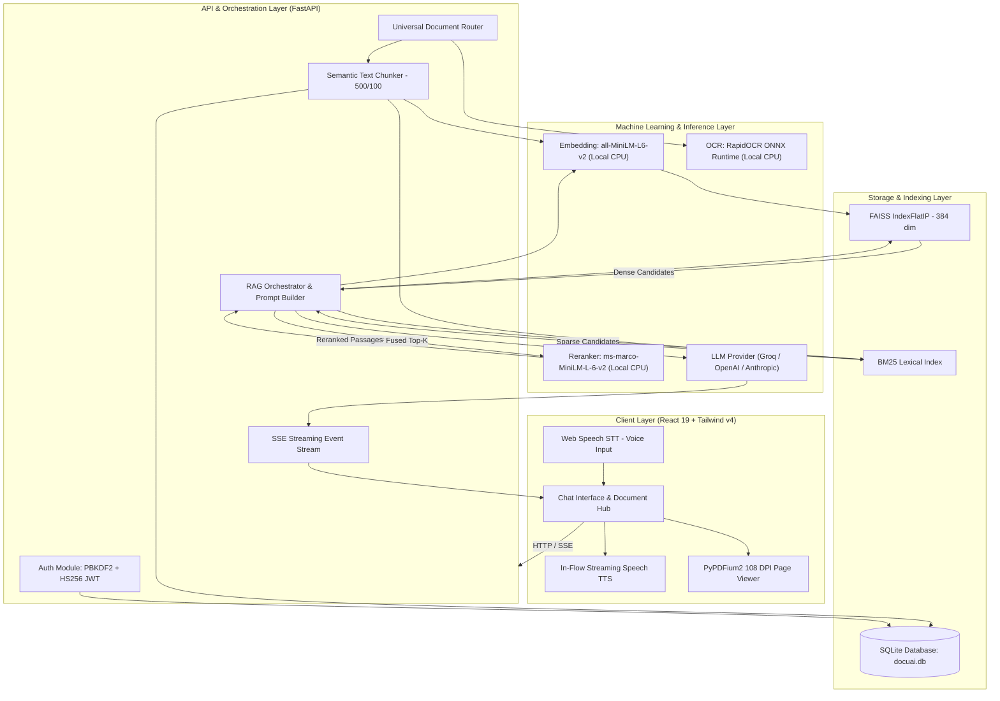

# DocuAI — Technical Design & Architecture Document

## Document Metadata
- **Project Name:** DocuAI (AI-Powered Multi-Modal Document Q&A System)
- **Version:** 1.0.4
- **Author :** Tapash Jaiswal
- **Date:** September 2026
- **Target Platform:** Windows, macOS, Linux
- **Runtime Environment:** Python 3.10–3.12, Node.js 18+

---

## 1. Executive Summary & Problem Context

DocuAI is an intelligent, multi-modal Retrieval-Augmented Generation (RAG) platform designed to resolve information retrieval and question answering over diverse unstructured enterprise documents. 

In enterprise environments, knowledge is siloed across disparate file types (digital and scanned PDFs, PowerPoint decks, Word documents, plain text notes, and images). Traditional search solutions suffer from two core limitations:
1. **Semantic Blindness of Lexical Search:** Keyword search cannot resolve conceptual queries, synonymy, or multi-turn conversational follow-ups.
2. **Hallucinations and Keyword Misses in Pure Dense Vector RAG:** Standalone embedding-based retrieval often overlooks precise alphanumeric codes, product SKUs, acronyms, and dense tabular metrics.

DocuAI solves these challenges through a **two-stage hybrid retrieval architecture** that fuses dense vector search (FAISS) with sparse lexical search (BM25) via **Reciprocal Rank Fusion (RRF)**, backed by a **Cross-Encoder reranking model** and strict grounding prompts.

---

## 2. System Architecture

DocuAI is partitioned into a modular, decoupled client-server architecture:
- **Client Layer:** Modern React 19 single-page application (SPA) with real-time Server-Sent Events (SSE) streaming, continuous Web Speech API integration (voice dictation and streaming text-to-speech), and Dark/Light visual styling.
- **API & Orchestration Layer:** FastAPI asynchronous REST service coordinating session state, document parsing, chunking, and LLM inference.
- **Retrieval & Storage Layer:** Local FAISS vector index, Rank-BM25 sparse index, and SQLite relational persistence for conversations, document metadata, chunks, and precomputed embeddings.

### Architecture Diagram (Mermaid)



---

## 3. Core Component Breakdown

### 3.1 Document Ingestion & Extraction Engine (`app/document_loader.py` & `app/pdf_loader.py`)
The system routes incoming files by MIME type and extension through dedicated extractors:
- **PDF Extraction:** Handled via `pypdf.PdfReader`. If a page contains no extractable digital text stream (e.g., scanned contracts, invoices), the system triggers an automatic fallback to `pypdfium2` rasterization and `RapidOCR` ONNX runtime to extract textual content.
- **PowerPoint Presentation (`.pptx`):** Extracted via `python-pptx`, traversing shapes, text frames, embedded tables, and slide notes. If slides contain embedded imagery without digital text, OCR is executed per image shape. Each slide is mapped to a 1-indexed page.
- **Word Document (`.docx`):** Extracted via `python-docx`, preserving heading styles (converted to Markdown headers `###`) and formatting tables with pipe delimiters (`|`). Long documents are segmented into logical ~450-word pages to maintain fine-grained citation scopes.
- **Text & Structured Formats (`.txt`, `.md`, `.csv`, `.json`, `.log`):** Ingested with dual-encoding fallback (UTF-8 with Latin-1 fallback), paginated logically at paragraph boundaries.
- **Direct Images (`.png`, `.jpg`, `.jpeg`, `.webp`, `.bmp`, `.tiff`):** Processed through `RapidOCR` ONNX runtime to return bounding-box parsed text lines mapped to page 1.
- **Raw Pasted Text (`/upload/text`):** Ingests arbitrary snippets and user meeting notes directly into the active session without requiring a physical file.

### 3.2 Chunking Strategy (`app/rag.py`)
- **Isolation by Page:** Chunking operates strictly within individual pages. A chunk never spans across page boundaries, ensuring citations unambiguously trace to exact source pages.
- **Window & Overlap:** Uses a target window of **500 characters** with a **100-character sliding overlap**. 
- **Sentence Boundary Preservation:** Text is segmented using sentence-aware splitting (`re.split(r'(?<=[.!?])\s+')`) so grammatical thoughts are not truncated mid-sentence.
- **Text Normalization:** De-hyphenates linebreaks (e.g., `imple-\nmentation` becomes `implementation`) and collapses redundant whitespace.

### 3.3 Hybrid Indexing & Retrieval Engine (`app/store.py`)
DocuAI implements a dual-index architecture maintained per session:
1. **Dense Vector Index (FAISS):**
   - Model: `sentence-transformers/all-MiniLM-L6-v2` (384-dimensional dense vectors).
   - Normalization: Embeddings are L2-normalized ($||v|| = 1.0$) upon generation.
   - Metric: `faiss.IndexFlatIP` computes inner product, which is mathematically identical to cosine similarity on normalized vectors.
2. **Sparse Lexical Index (Rank-BM25):**
   - Algorithm: Okapi BM25 (`rank-bm25`).
   - Tokenization: Alphanumeric word-boundary tokenization with lowercasing.
   - Purpose: Overcomes semantic drift for exact keywords, acronyms, and product codes.
3. **Reciprocal Rank Fusion (RRF):**
   Dense and sparse search results are merged using:
   $$RRF\_Score(d) = \frac{1}{60 + r_{dense}(d)} + \frac{1}{60 + r_{sparse}(d)}$$
   This guarantees that chunks performing well across both modalities or excelling strongly in one are bubbled to the top.

### 3.4 Second-Stage Reranker (`app/reranker.py`)
- **Model:** `cross-encoder/ms-marco-MiniLM-L-6-v2`.
- **Cross-Attention:** Unlike bi-encoders which encode query and document independently, the cross-encoder passes the combined pair `(query, passage)` through deep cross-attention layers, computing a granular relevance logit.
- **Guaranteed Slots Strategy:** Cross-encoders trained on MS MARCO passage benchmarks can occasionally penalize compact tabular text lacking conversational syntax. DocuAI preserves the top $top\_k - 1$ first-stage candidates and employs the cross-encoder to select the final slot from the remaining candidate pool.

### 3.5 LLM Abstraction & Prompt Engineering (`app/llm.py` & `app/main.py`)
- **Swappable Providers:** Abstract base class `LLMClient` with implementations for `GroqClient`, `OpenAIClient`, and `AnthropicClient`.
- **System Directives:** Enforces strict grounding. When retrieved context does not contain sufficient facts to answer the question, the system is instructed to return verbatim:
  `**I couldn't find that in the document.**`
- **Citation Stripping:** The LLM is directed never to output bracketed chunk IDs (e.g., `[Chunk 0]`) in raw text. All citations are emitted as structured metadata and rendered cleanly by the frontend.
- **Conversational Memory:** Preserves the last 5 conversational turns (10 messages) stored in SQLite to resolve contextual pronouns ("it", "the third option", "that company").

### 3.6 Security & Authentication (`app/auth.py`)
- **Password Hashing:** Implemented using Python's standard `hashlib.pbkdf2_hmac` with SHA-256, 100,000 iterations, and a random 16-byte cryptographically secure salt (`secrets.token_hex(16)`).
- **Session Tokens:** RFC 7519 JSON Web Tokens (JWT) signed with HMAC-SHA256 (HS256) and a configurable secret key (`DOCUAI_SECRET_KEY`), with a 3-day expiration period.
- **Multi-Tenancy:** User-scoped session queries filter documents and conversations by `user_id`.

---

## 4. End-to-End Pipeline Workflows

### 4.1 Ingestion Workflow

```
[Uploaded File] ──► MIME/Ext Check ──► Document Extractor (pypdf/pptx/docx/RapidOCR)
                                                │
                                                ▼
                                    List of (text, page_num)
                                                │
                                                ▼
                                    Sentence-Aware Chunking
                                    (500 chars, 100 overlap)
                                                │
                                                ▼
                                    Generate Embeddings
                                    (all-MiniLM-L6-v2, 384-dim)
                                                │
                          ┌─────────────────────┼─────────────────────┐
                          ▼                     ▼                     ▼
                  Store Chunks &         Index in FAISS        Index in BM25
                 Vectors in SQLite       (Dense Vector)       (Sparse Lexical)
```

### 4.2 Query & Streaming Workflow

```
[User Query] ──► Natural Language / Voice STT
                       │
                       ▼
            Generate Query Embedding
                       │
             ┌─────────┴─────────┐
             ▼                   ▼
        FAISS Search        BM25 Search
        (Top-3x Candidates) (Top-3x Candidates)
             │                   │
             └─────────┬─────────┘
                       ▼
             Reciprocal Rank Fusion (k=60)
                       │
                       ▼
             Cross-Encoder Reranker
             (Guaranteed Slots Strategy)
                       │
                       ▼
             Select Top-K Chunks + Assemble Prompt
             (Context + Manifest + Last 5 Turns History)
                       │
                       ▼
             LLM Generation (Groq / OpenAI / Anthropic)
                       │
                       ▼
             Server-Sent Events (SSE Stream)
             ├─ Event: Live Pipeline Status
             ├─ Event: Answer Tokens (delta chunks)
             └─ Event: Final Metadata (sources, page numbers, session_id, latency)
```

---

## 5. Database Architecture & Schema

DocuAI utilizes SQLite (`data/docuai.db`) with Foreign Key enforcement (`PRAGMA foreign_keys = ON`).

### Entity Relationship Model

```sql
-- Users table: Credentials & account records
CREATE TABLE users (
    id TEXT PRIMARY KEY,
    name TEXT NOT NULL,
    email TEXT UNIQUE NOT NULL,
    password_hash TEXT NOT NULL,
    created_at TEXT NOT NULL
);

-- Sessions table: Chat conversation workspaces
CREATE TABLE sessions (
    id TEXT PRIMARY KEY,
    title TEXT NOT NULL,
    user_id TEXT,
    created_at TEXT NOT NULL,
    updated_at TEXT NOT NULL,
    FOREIGN KEY (user_id) REFERENCES users(id) ON DELETE CASCADE
);

-- Documents table: Ingested file metadata
CREATE TABLE documents (
    id TEXT PRIMARY KEY,
    session_id TEXT NOT NULL,
    filename TEXT NOT NULL,
    pages_count INTEGER NOT NULL,
    chunks_count INTEGER NOT NULL,
    created_at TEXT NOT NULL,
    FOREIGN KEY (session_id) REFERENCES sessions(id) ON DELETE CASCADE
);

-- Chunks table: Extracted passages & precomputed embedding BLOBs
CREATE TABLE chunks (
    id INTEGER PRIMARY KEY AUTOINCREMENT,
    session_id TEXT NOT NULL,
    doc_id TEXT NOT NULL,
    doc_name TEXT NOT NULL,
    page INTEGER NOT NULL,
    chunk_index INTEGER NOT NULL,
    text TEXT NOT NULL,
    embedding BLOB NOT NULL,
    FOREIGN KEY (session_id) REFERENCES sessions(id) ON DELETE CASCADE
);

-- Messages table: Chat turns with cited sources and generation latency
CREATE TABLE messages (
    id INTEGER PRIMARY KEY AUTOINCREMENT,
    session_id TEXT NOT NULL,
    role TEXT NOT NULL,
    content TEXT NOT NULL,
    sources TEXT,
    latency_ms INTEGER,
    created_at TEXT NOT NULL,
    FOREIGN KEY (session_id) REFERENCES sessions(id) ON DELETE CASCADE
);
```

---

## 6. Technology Stack Specification

| Category | Technology | Version | Justification |
| :--- | :--- | :--- | :--- |
| **API Framework** | FastAPI | `0.115.0` | Asynchronous, native OpenAPI documentation, lightweight. |
| **ASGI Server** | Uvicorn | `0.32.0` | High-throughput asynchronous server. |
| **Vector Index** | FAISS (faiss-cpu) | `1.9.0` | Ultra-fast C++ vector similarity indexing on CPU. |
| **Lexical Index** | Rank-BM25 | `>=0.2.2` | Robust Okapi BM25 implementation in pure Python. |
| **Embeddings** | Sentence-Transformers | `3.2.1` | `all-MiniLM-L6-v2` executes in ~15ms on CPU; zero API cost. |
| **Reranker** | Cross-Encoder | `3.2.1` | `ms-marco-MiniLM-L-6-v2` re-ranks top passages with cross-attention. |
| **OCR Engine** | RapidOCR ONNX Runtime | `>=1.4.4` | Offline, zero-dependency OCR engine based on PaddleOCR ONNX models. |
| **PDF Renderer** | PyPDFium2 | `>=5.13.0` | High-speed PDF rasterization for page previews and OCR fallback. |
| **Office Parsers** | python-pptx / python-docx | `>=1.0.2` | Pure-python document structure parsers. |
| **Frontend UI** | React 19 + Vite | `19.0.0` | Reactive state management, lightning-fast HMR build pipeline. |
| **CSS Framework** | Tailwind CSS v4 | `4.0.0` | Modern utility CSS with native CSS variables and dark mode support. |
| **Voice Engine** | Web Speech API | Native | Browser-native STT & TTS with zero cloud API latency or cost. |

---

## 7. Operational Limitations & Future Scope

### Current Limitations
1. **In-Memory FAISS Vector Index:** While chunks and embedding vectors are persisted in SQLite as raw binary BLOBs, the FAISS index itself is reconstructed into memory on server restart. For corpora exceeding 1,000,000 chunks, a persistent vector database (e.g., Milvus, Qdrant, or pgvector) would be required.
2. **Complex Multi-Column PDF Tables:** While `pypdf` extracts tabular strings and `python-docx` formats tables as Markdown, complex merged-cell PDF tables can suffer text-flow interleaving.
3. **Browser Compatibility for STT:** Web Speech API continuous recognition is natively supported in Chromium-based browsers (Chrome, Edge, Brave) and Safari, but may have limited speech recognition support in Firefox.

### Future Roadmap
- **Persistent Vector Store Migration:** Optional adapter for Qdrant or Milvus for enterprise clustering.
- **Vision-Language Model (VLM) Parsing:** Integration of multimodal models (e.g., ColPali or Gemini Flash Vision) for direct visual understanding of schematics and infographics.
- **Role-Based Access Control (RBAC):** Organization, team, and workspace multi-tenancy levels beyond user-isolated sessions.
